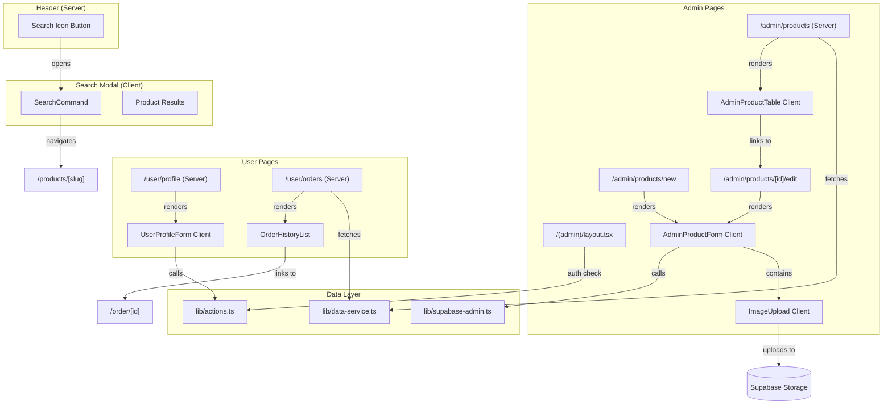

# 5. Component Architecture

## New Components

### SearchCommand Component (Story 1.4)

**Location:** `components/search/SearchCommand.tsx`

**Responsibility:** Provides a command palette modal for instant product search with keyboard navigation

**Integration Points:**
- Triggered from Header component (search icon button)
- Navigates to product detail pages on selection
- Receives product list as prop (pre-fetched by parent)

**Key Interfaces:**
- `SearchCommandProps { products: Product[], open: boolean, onOpenChange: (open: boolean) => void }`
- Uses shadcn `Command` + `Dialog` components

**Dependencies:**
- **Existing Components:** Header (trigger), ProductCard patterns (display)
- **New Components:** None
- **shadcn:** `command`, `dialog`

**Technology Stack:** Client Component ("use client") - requires useState for search input, keyboard events

---

### UserProfileForm Component (Story 1.3)

**Location:** `components/user/UserProfileForm.tsx`

**Responsibility:** Displays and allows editing of user profile information (name, shipping address)

**Integration Points:**
- Used in `/user/profile` page
- Calls `updateUserProfile` Server Action on submit
- Pre-populated with existing user data

**Key Interfaces:**
- `UserProfileFormProps { user: UserProfile }`
- Form fields: fullName, address (nested: streetAddress, city, postalCode, country)

**Dependencies:**
- **Existing Components:** ShippingAddressForm patterns (reuse form structure)
- **New Components:** None
- **Existing Actions:** Extend `lib/actions.ts` with `updateUserProfile`

**Technology Stack:** Client Component - React Hook Form + Zod validation + Sonner toast

---

### OrderHistoryList Component (Story 1.5)

**Location:** `components/user/OrderHistoryList.tsx`

**Responsibility:** Displays paginated list of user's past orders with status badges

**Integration Points:**
- Used in `/user/orders` page
- Links to existing `/order/[id]` detail pages
- Receives orders array from Server Component parent

**Key Interfaces:**
- `OrderHistoryListProps { orders: OrderSummary[], totalPages: number, currentPage: number }`
- `OrderSummary { id, createdAt, isPaid, itemCount, totalPrice }`

**Dependencies:**
- **Existing Components:** ProductPagination (reuse pagination pattern)
- **New Components:** None
- **shadcn:** `badge`, `table`

**Technology Stack:** Server Component (no client interactivity needed) OR Client if pagination is client-side

---

### AdminProductTable Component (Story 1.8)

**Location:** `components/admin/AdminProductTable.tsx`

**Responsibility:** Displays all products in a data table with edit/delete actions

**Integration Points:**
- Used in `/admin/products` page
- Links to edit pages, triggers delete confirmation
- Receives products array from Server Component parent

**Key Interfaces:**
- `AdminProductTableProps { products: Product[] }`
- Actions: Edit (link), Delete (dialog trigger)

**Dependencies:**
- **Existing Components:** None directly
- **New Components:** DeleteProductDialog
- **shadcn:** `table`, `alert-dialog`, `button`

**Technology Stack:** Client Component - needs delete confirmation dialog state

---

### AdminProductForm Component (Story 1.8)

**Location:** `components/admin/AdminProductForm.tsx`

**Responsibility:** Form for creating and editing products with all fields

**Integration Points:**
- Used in `/admin/products/new` and `/admin/products/[id]/edit` pages
- Calls `createProduct` or `updateProduct` Server Actions
- Auto-generates slug from name

**Key Interfaces:**
- `AdminProductFormProps { product?: Product }` (undefined for create, populated for edit)
- Fields: name, slug, category, brand, description, price, stock, image

**Dependencies:**
- **Existing Components:** Form patterns from ShippingAddressForm
- **New Components:** ImageUpload (Story 1.9)
- **Existing Validators:** `insertProductSchema`

**Technology Stack:** Client Component - React Hook Form + Zod + image preview

---

### ImageUpload Component (Story 1.9)

**Location:** `components/admin/ImageUpload.tsx`

**Responsibility:** Handles image upload to Supabase Storage with preview

**Integration Points:**
- Used within AdminProductForm
- Uploads to `products` bucket
- Returns public URL for storage in Product.image

**Key Interfaces:**
- `ImageUploadProps { value?: string, onChange: (url: string) => void }`
- Validates file type (jpg, png, webp) and size (max 2MB)

**Dependencies:**
- **Existing Components:** None
- **New Components:** None
- **Supabase:** Storage client

**Technology Stack:** Client Component - file input handling, upload progress

---

## Component Interaction Diagram



## Existing Component Modifications

| Component | Modification | Reason |
|-----------|--------------|--------|
| **Header** | Add search icon button trigger | Opens SearchCommand modal |
| **UserMenu** | Add "Profile" and "Orders" links | Navigation to new user pages |
| **lib/actions.ts** | Add new Server Actions | `updateUserProfile`, `createProduct`, `updateProduct`, `deleteProduct` |
| **lib/data-service.ts** | Add new read functions | `getUserOrders`, `getProductsForAdmin` |

## Component Patterns to Follow

Based on existing codebase analysis:

1. **Server Component Data Fetching:**
   ```tsx
   // Page fetches data, passes to client component
   export default async function OrdersPage() {
     const orders = await getUserOrders();
     return <OrderHistoryList orders={orders} />;
   }
   ```

2. **Client Component with Server Action:**
   ```tsx
   "use client";

   export function UserProfileForm({ user }: Props) {
     const form = useForm({ resolver: zodResolver(schema) });
     const [isPending, startTransition] = useTransition();

     const onSubmit = (data: FormData) => {
       startTransition(async () => {
         const result = await updateUserProfile(data);
         if (result.success) {
           toast.success(result.message);
         } else {
           toast.error(result.message);
         }
       });
     };

     return <Form {...form}>...</Form>;
   }
   ```

3. **Props Passing Pattern (Server → Client):**
   ```tsx
   // Server Component
   const products = await getProducts();
   <SearchCommand products={products} open={open} onOpenChange={setOpen} />
   ```

---
